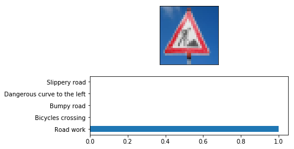
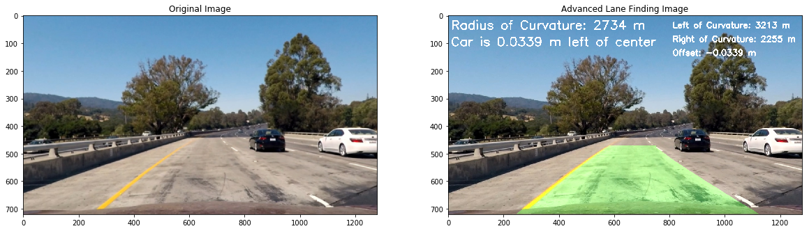
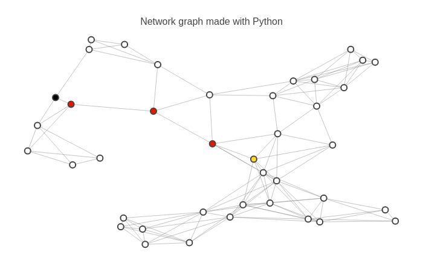
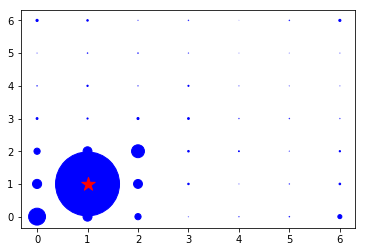
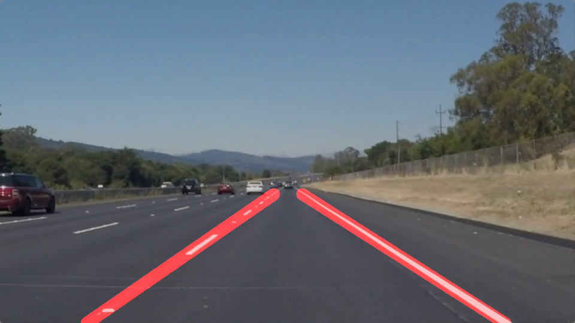
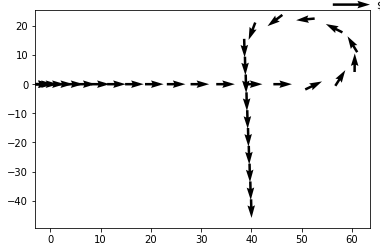
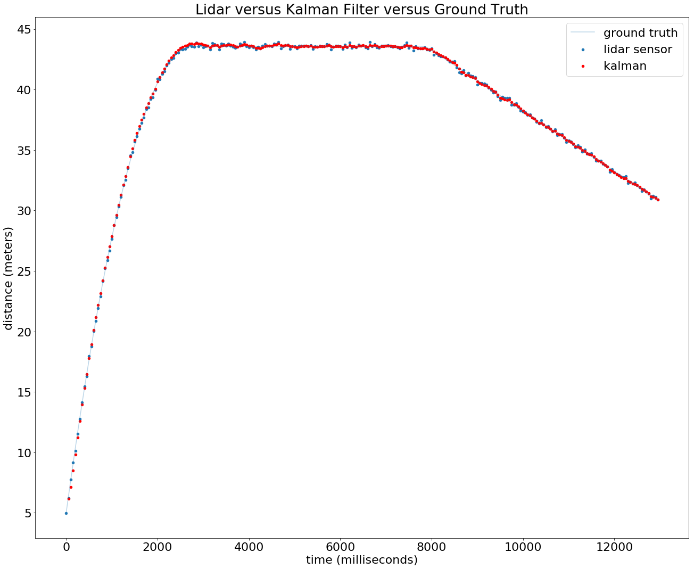
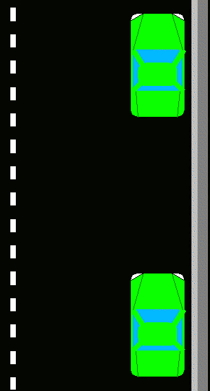

## Quick About Me
---
Born and raised in Malaysia but currently in the US. I graduated with a bachelors in Electrical Engineering (Spring 2020) where a pandemic robbed my convocation. Wondering where I'll be next.

Since I was a kid, I've always been fascinated by the tech world. 
A life-long learner to push my limits and excited to see what the world can achieve together. 
Passionate moving forward into an AV and AI world.

Outside of work, I love outdoor activities such as kayaking and hiking.
Active player in many sports, played competitively especially in squash and racquetball.

Fluent in English, Malay, Mandarin, and Cantonese.

[View my resume:](/Leong_Resume.pdf)

## Projects 
---
Here is a list of the projects:
* [Traffic Sign Classifier](#traffic-sign-classifier)
* [Advance Lane Finding](#advance-lane-finding)
* [Route Planner A* Search](#route-planner-a-star-search)
* [Sensing Movement Histogram Filter 2D](#sensing-movement-histogram-filter-2d)
* [Traffic Light Classifier](#traffic-light-classifier)
* [Finding Lane Lines](#finding-lane-lines)
* [Reconstruction Trajectories](#reconstruction-trajectories)
* [Kalman Filter with Matrix Class](#kalman-filter-with-matrix-class)
* [Joy Ride Parallel Parking](#joy-ride-parallel-parking)
* [Sensing Movement Bayes Theorem 1D](#sensing-movement-bayes-theorem-1d)

## Project Descriptions
---
### **Traffic Sign Classifier**
- Using LeNet-5 (Deep Learning) to build a Traffic Sign Recognition Classifier 

[More info on Github](https://github.com/ianleongg/Traffic-Sign-Classifier)

{:.lead width="497" height="252" loading="lazy"}
traffic sign image obtained from the web and evaluated using our trained model.
{:.figcaption}

---
### **Advance Lane Finding** 
- Using images/video (Computer Vision) to build a lane finding algorithm 

[More info on Github](https://github.com/ianleongg/Advance-Lane-Finding)

{:.lead width="1159" height="332" loading="lazy"}
algorithm successfuly drawing on detected lane
{:.figcaption}

---

### **Route Planner A Star Search** 
- Using A* search algorithm to implement a 'Google-maps' route planning algorithm

[More info on Github](https://github.com/ianleongg/Route-Planner-A--Search)

{:.lead width="700" height="450" loading="lazy"}
Black Dot: Starting point; Red Dot: Path taken; Yellow Dot: Destination Point
{:.figcaption}

---

### **Sensing Movement Histogram Filter 2D** 
- 2D histogram filter with sence and move function for a car in Python, C++ and Optimized C++

[More info on Github](https://github.com/ianleongg/Sensing-Movement-Histogram-Filter-2D)
  

{:.lead width="366" height="252" loading="lazy"}
sense function
{:.figcaption}

---

### **Traffic Light Classifier** 
- Using openCV to classify red,yellow,green with accuracy >90% and never classify red as green

[More info on Github](https://github.com/ianleongg/Traffic_Light_Classifier)

{:.lead width="1696" height="582" loading="lazy"}
example of the process
{:.figcaption}

---

### **Finding Lane Lines** 
- Using masking, canny edge detection, and hough transformation to detect lane lines

[More info on Github](https://github.com/ianleongg/Finding-Lane-Lines)

{:.lead width="960" height="540" loading="lazy"}
lane lines detected
{:.figcaption}

---
### **Reconstruction Trajectories** 
- Use raw acceleration, displacement, and angular rotation data from a vehicle's sensory data to plot trajectory

[More info on Github](https://github.com/ianleongg/Reconstruction_Trajectories)

{:.lead width="380" height="252" loading="lazy"}
example of accelerating and then turn 270 degrees left
{:.figcaption}

---

### **Kalman Filter with Matrix Class** 
- Kalman filter implemented based on matrix class functions such as addition, subtraction, transpose, multiplication, determinant etc

[More info on Github](https://github.com/ianleongg/Kalman-Filter-Matrix-Class)

{:.lead width="1304" height="1069" loading="lazy"}
visualization of the Kalman filter
{:.figcaption}

---
### **Joy Ride Parallel Parking**
- A simple program to parallel park based on steering angles, forward, reverse motions 

[More info on Github](https://github.com/ianleongg/Joy-Ride-Parallel-Parking)

{:.lead width="305" height="569" loading="lazy"}
example of function execution
{:.figcaption}

---
### **Sensing Movement Bayes Theorem 1D** 
- Writing a simple sense and move program for a car based on Bayes Theorem in C++

[More info on Github](https://github.com/ianleongg/Sensing-Movement-Bayes-Theorem-1D)

---

